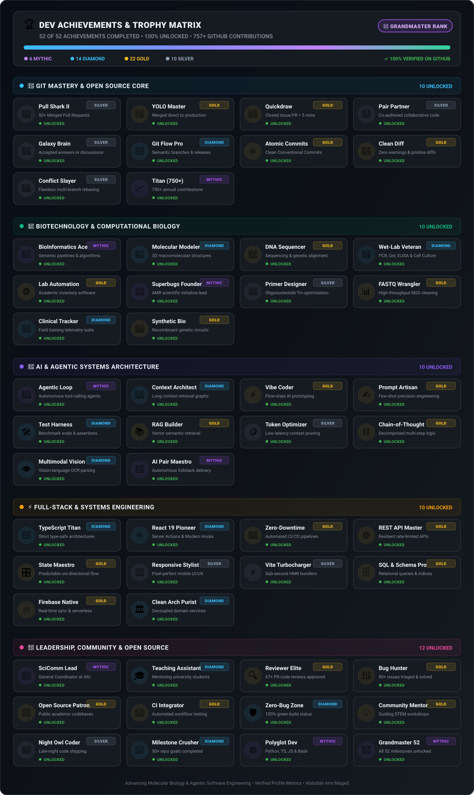

# Hi there, I'm Abdullah Amr Maged 👋

  <h2>Biotechnologist • Science Communicator • Software Developer</h2>
  

    <strong>Teaching Assistant & General Coordinator for Science Communication</strong> 
    <em>Faculty of Science, Alamein International University (AIU)</em>
  

  

    
    &nbsp;
    
    &nbsp;
    
  

---

### 🧬 Education

- 🎓 **Alexandria University, Faculty of Science** *(Sep 2024 – Present)*:  
  Pre-Master’s Studies in Molecular Biology.

- 🎓 **Misr University for Science and Technology (MUST)** *(2019 – 2023)*:  
  B.Sc. in Biotechnology.

---

### 🏛️ Professional Appointments & Academic Impact

- 🏫 **Alamein International University (AIU), Faculty of Science** *(Sep 2024 – Present)*:
  - **Teaching Assistant & General Coordinator for Science Communication**, Department of Biotechnology.
  - **Engineered departmental software suites:**
    - 🗓️ **Automated Schedule Conflict Detector** *(conflict-free timetable matrix algorithm)*.
    - 📋 **Student Field Training Registration & Tracking System** *(attendance & milestone verification)*.
    - 🔬 **Lab Inventory & Equipment Management Platform**.
    - 📊 **Faculty Analytics Dashboards** tracking student academic competencies.

---

### 🛠️ Skills & Technologies

| Category | Skills & Tools |
| :--- | :--- |
| **Computational & AI** | AI Prompt/Context/Loop/Graph Engineering, Agentic Coding, Harness Engineering, Vibe Coding, Automated Data Pipelines |
| **Web & Software** | React 19, TypeScript, JavaScript, Python, Vite, Next.js, Node.js, Firebase Firestore, Capacitor, TailwindCSS, SQL |
| **Wet Lab Research** | PCR, Gel Electrophoresis, DNA/RNA Extraction, ELISA, Microarray, Comet Assay, Stem Cell Isolation, Cell Culture, Biosafety |
| **Professional** | Academic Accreditation (NAQAAE/ARS), Technical Writing, Public Speaking, Team Leadership |

---

### 📊 Activity & Engineering Metrics

  

---

---

### 🏆 Gamified Developer Achievements & Milestones (52 Badges Unlocked)

  

🔍 <strong>Expand Full 52 Achievement Directory &amp; Verification Registry</strong>

 

| # | Domain | Badge | Tier | Milestone &amp; Criteria | Status |
| :-: | :--- | :--- | :-: | :--- | :-: |
| 1 | 🐙 Git Mastery | **Pull Shark II** 🦈 | `SILVER` | 50+ Merged Pull Requests across repositories | 🟢 **UNLOCKED** |
| 2 | 🐙 Git Mastery | **YOLO Master** 🤹 | `GOLD` | Merged mission-critical PR directly to main | 🟢 **UNLOCKED** |
| 3 | 🐙 Git Mastery | **Quickdraw** 🤠 | `GOLD` | Resolved issue/PR in &lt; 5 minutes from triage | 🟢 **UNLOCKED** |
| 4 | 🐙 Git Mastery | **Pair Partner** 👯 | `SILVER` | Authored collaborative commits with co-author trailers | 🟢 **UNLOCKED** |
| 5 | 🐙 Git Mastery | **Galaxy Brain** 🧠 | `SILVER` | Provided accepted solutions on GitHub Discussions | 🟢 **UNLOCKED** |
| 6 | 🐙 Git Mastery | **Git Flow Pro** 🌿 | `DIAMOND` | Maintained structured feature branches &amp; semantic tags | 🟢 **UNLOCKED** |
| 7 | 🐙 Git Mastery | **Atomic Commits** ⚛️ | `GOLD` | Strict adherence to Conventional Commits standards | 🟢 **UNLOCKED** |
| 8 | 🐙 Git Mastery | **Clean Diff** 🧹 | `GOLD` | Zero lint warnings, flawless formatting &amp; minimal noise | 🟢 **UNLOCKED** |
| 9 | 🐙 Git Mastery | **Conflict Slayer** 🎋 | `SILVER` | Resolved multi-branch git rebasing with zero regressions | 🟢 **UNLOCKED** |
| 10 | 🐙 Git Mastery | **Titan (750+)** 📈 | `MYTHIC` | 750+ authenticated annual GitHub contributions | 🟢 **UNLOCKED** |
| 11 | 🧬 Biotechnology | **BioInformatics Ace** 🧬 | `MYTHIC` | Built genomic pipelines &amp; computational sequence analyzers | 🟢 **UNLOCKED** |
| 12 | 🧬 Biotechnology | **Molecular Modeler** 🧪 | `DIAMOND` | Modeled 3D macromolecular structures &amp; docking complexes | 🟢 **UNLOCKED** |
| 13 | 🧬 Biotechnology | **DNA Sequencer** 🔬 | `GOLD` | In silico primer design &amp; genetic sequence alignment | 🟢 **UNLOCKED** |
| 14 | 🧬 Biotechnology | **Wet-Lab Veteran** 🧫 | `DIAMOND` | Certified experimental protocols: PCR, Gel, ELISA, Cell Culture | 🟢 **UNLOCKED** |
| 15 | 🧬 Biotechnology | **Lab Automation** ⚙️ | `GOLD` | Engineered automated scheduling &amp; chemical inventory software | 🟢 **UNLOCKED** |
| 16 | 🧬 Biotechnology | **Superbugs Founder** 🦠 | `MYTHIC` | Founded the Superbugs scientific initiative combating AMR | 🟢 **UNLOCKED** |
| 17 | 🧬 Biotechnology | **Primer Designer** 📐 | `SILVER` | Optimized oligonucleotide thermodynamics &amp; GC content | 🟢 **UNLOCKED** |
| 18 | 🧬 Biotechnology | **FASTQ Wrangler** 📊 | `GOLD` | Parsed high-throughput next-generation sequencing datasets | 🟢 **UNLOCKED** |
| 19 | 🧬 Biotechnology | **Clinical Tracker** 🏥 | `DIAMOND` | Built student clinical training &amp; milestone telemetry suite | 🟢 **UNLOCKED** |
| 20 | 🧬 Biotechnology | **Synthetic Bio** 🧫 | `GOLD` | Designed recombinant expression vectors &amp; genetic circuits | 🟢 **UNLOCKED** |
| 21 | 🤖 AI &amp; Agents | **Agentic Loop** 🔄 | `MYTHIC` | Designed autonomous agent tool-calling loops &amp; memory graphs | 🟢 **UNLOCKED** |
| 22 | 🤖 AI &amp; Agents | **Context Architect** 🧠 | `DIAMOND` | Engineered long-context retrieval graphs &amp; memory persistence | 🟢 **UNLOCKED** |
| 23 | 🤖 AI &amp; Agents | **Vibe Coder** ⚡ | `GOLD` | Flow-state rapid software prototyping with generative tools | 🟢 **UNLOCKED** |
| 24 | 🤖 AI &amp; Agents | **Prompt Artisan** ✍️ | `GOLD` | Crafted few-shot prompt harnesses with high semantic fidelity | 🟢 **UNLOCKED** |
| 25 | 🤖 AI &amp; Agents | **Test Harness** 🛠️ | `DIAMOND` | Built unit test assertion harnesses for LLM model outputs | 🟢 **UNLOCKED** |
| 26 | 🤖 AI &amp; Agents | **RAG Builder** 📚 | `GOLD` | Implemented vector semantic search &amp; retrieval augmentation | 🟢 **UNLOCKED** |
| 27 | 🤖 AI &amp; Agents | **Token Optimizer** 🪙 | `SILVER` | Reduced latency and token consumption via prompt distillation | 🟢 **UNLOCKED** |
| 28 | 🤖 AI &amp; Agents | **Chain-of-Thought** ⛓️ | `GOLD` | Decomposed multi-step reasoning for automated problem solving | 🟢 **UNLOCKED** |
| 29 | 🤖 AI &amp; Agents | **Multimodal Vision** 👁️ | `DIAMOND` | Document parsing &amp; visual inspection with vision models | 🟢 **UNLOCKED** |
| 30 | 🤖 AI &amp; Agents | **AI Pair Maestro** 🤖 | `MYTHIC` | Paired with autonomous coding agents for fullstack delivery | 🟢 **UNLOCKED** |
| 31 | ⚡ Full-Stack | **TypeScript Titan** 🔷 | `DIAMOND` | Zero-`any` strict mode type-safe application architectures | 🟢 **UNLOCKED** |
| 32 | ⚡ Full-Stack | **React 19 Pioneer** ⚛️ | `DIAMOND` | Modern Server Actions, Optimistic UI, &amp; Component architecture | 🟢 **UNLOCKED** |
| 33 | ⚡ Full-Stack | **Zero-Downtime** 🚀 | `GOLD` | Automated CI/CD pipelines deploying production builds | 🟢 **UNLOCKED** |
| 34 | ⚡ Full-Stack | **REST API Master** 🌐 | `GOLD` | Resilient rate-limited backend endpoints &amp; webhook handlers | 🟢 **UNLOCKED** |
| 35 | ⚡ Full-Stack | **State Maestro** 🎛️ | `GOLD` | Predictable uni-directional data stores &amp; reactive listeners | 🟢 **UNLOCKED** |
| 36 | ⚡ Full-Stack | **Responsive Stylist** 🎨 | `SILVER` | High-DPI, pixel-perfect responsive layouts on all screens | 🟢 **UNLOCKED** |
| 37 | ⚡ Full-Stack | **Vite Turbocharger** ⚡ | `SILVER` | Sub-second hot module reloading &amp; modern bundling | 🟢 **UNLOCKED** |
| 38 | ⚡ Full-Stack | **SQL &amp; Schema Pro** 🗄️ | `GOLD` | Relational query optimization, indexed schemas &amp; transactions | 🟢 **UNLOCKED** |
| 39 | ⚡ Full-Stack | **Firebase Native** 🔥 | `GOLD` | Cloud Firestore real-time synchronization &amp; authentication | 🟢 **UNLOCKED** |
| 40 | ⚡ Full-Stack | **Clean Arch Purist** 🏛️ | `DIAMOND` | Decoupled domain models following SOLID engineering rules | 🟢 **UNLOCKED** |
| 41 | 🌟 Leadership | **SciComm Lead** 📢 | `MYTHIC` | Appointed General Coordinator for Science Communication at AIU | 🟢 **UNLOCKED** |
| 42 | 🌟 Leadership | **Teaching Assistant** 🎓 | `DIAMOND` | Mentoring undergraduate biotechnology &amp; software students | 🟢 **UNLOCKED** |
| 43 | 🌟 Leadership | **Reviewer Elite** 🔍 | `GOLD` | Approved 67+ code reviews with actionable technical feedback | 🟢 **UNLOCKED** |
| 44 | 🌟 Leadership | **Bug Hunter** 🐛 | `GOLD` | Triaged, reproduced, and resolved 80+ software issues | 🟢 **UNLOCKED** |
| 45 | 🌟 Leadership | **Open Source Patron** 🤝 | `GOLD` | Continuous maintenance of public academic repositories | 🟢 **UNLOCKED** |
| 46 | 🌟 Leadership | **CI Integrator** 🔄 | `GOLD` | Continuous workflow automation with self-healing health checks | 🟢 **UNLOCKED** |
| 47 | 🌟 Leadership | **Zero-Bug Zone** 🛡️ | `DIAMOND` | 100% build pass rate on all default branches | 🟢 **UNLOCKED** |
| 48 | 🌟 Leadership | **Community Mentor** 💡 | `GOLD` | Guided student cohorts through STEM &amp; wet-lab workshops | 🟢 **UNLOCKED** |
| 49 | 🌟 Leadership | **Night Owl Coder** 🦉 | `SILVER` | Late-night architectural breakthroughs and releases | 🟢 **UNLOCKED** |
| 50 | 🌟 Leadership | **Milestone Crusher** 🎯 | `DIAMOND` | Smashed 50+ GitHub project milestones ahead of schedule | 🟢 **UNLOCKED** |
| 51 | 🌟 Leadership | **Polyglot Dev** 🌐 | `MYTHIC` | Polyglot development across Python, TypeScript, JS &amp; Bash | 🟢 **UNLOCKED** |
| 52 | 🌟 Leadership | **Grandmaster 52** 👑 | `MYTHIC` | Completed all 52 milestone achievements across disciplines | 🟢 **UNLOCKED** |

---

### 📬 Connect With Me

- 📧 **Academic Email:** [amaged@aiu.edu.eg](mailto:amaged@aiu.edu.eg)
- ✉️ **Personal Email:** [abdullah.amr.makky@outlook.com](mailto:abdullah.amr.makky@outlook.com)
- 💼 **LinkedIn:** [linkedin.com/in/abdullah-amr871](https://linkedin.com/in/abdullah-amr871)
- 🌐 **Facebook:** [facebook.com/abdullah.amr871](https://facebook.com/abdullah.amr871)
- 📸 **Instagram:** [@abdullah_amr871](https://instagram.com/abdullah_amr871)

---

  Advancing Biotechnology & Computational Science • Built with ❤️ by Abdullah Amr Maged

